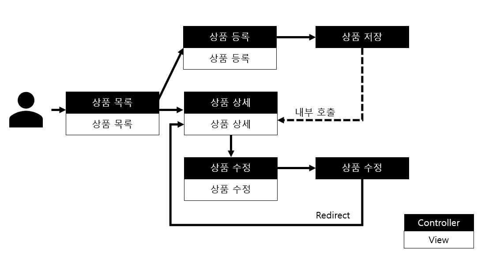

# 스프링 MVC

> 본 레포지토리는 Spring을 이용한 간단한 CRUD 구현 및 테스트를 위한 프로젝트 입니다.

***

### 목차

* Spring MVC에 관해
    * [1편](https://github.com/yeon-06/inflearnMvc1)
    * [2편](https://github.com/yeon-06/inflearnMVC1-2)  
 
* 프로젝트 진행

####프로젝트 요구 사항  

상품 도메인 모델
* 상품 ID
* 상품명
* 가격
* 수량 
  

상품 관리 기능
* 상품 목록
* 상품 상세
* 상품 등록
* 상품 수정  

####서비스 제공 흐름

***